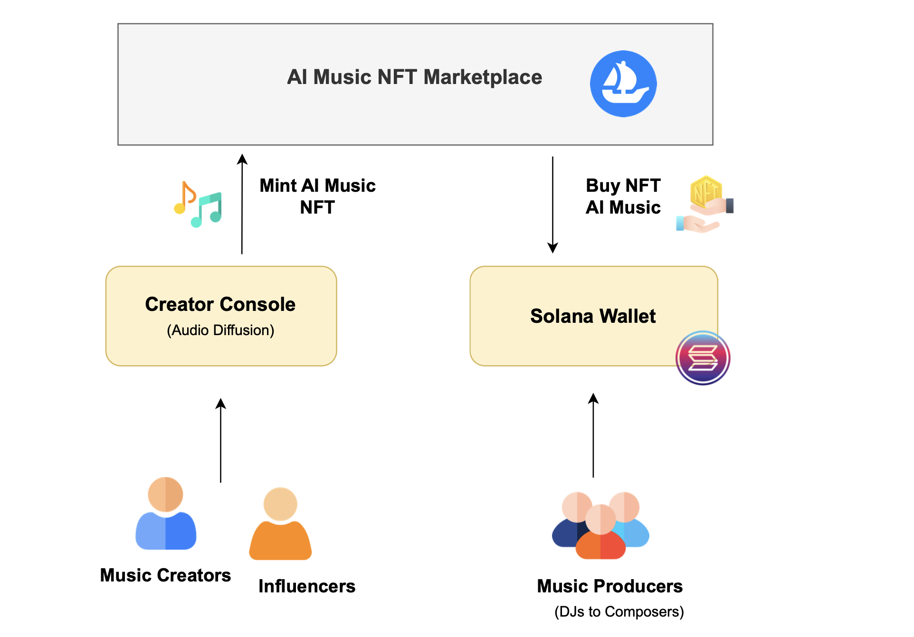
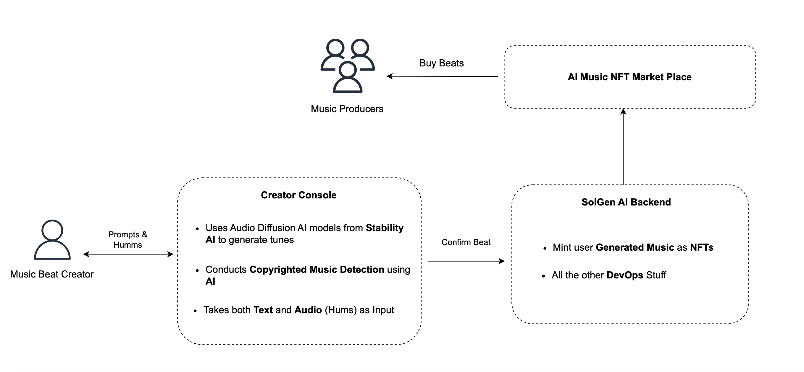

# SolGenAI

## Summary
Introducing SolGenAI: a groundbreaking platform poised to revolutionize the music industry by harnessing the latest in AI music generation and blockchain technologies. Imagine the ability to transform your musical ideas into reality with just a few simple prompts or a melody hummed into your phone. SolGenAI makes this possible, offering anyone the power to create stunning, high-quality music beats without the need for extensive musical training or expensive equipment.

But SolGenAI doesn't stop there. It empowers creators by integrating with the Solana blockchain, enabling you to mint your beats as NFTs. This not only secures a permanent record of your creation but also certifies its originality and authenticity in a digital landscape often cluttered with duplicates and confusion. By leveraging blockchain technology, SolGenAI ensures your unique contributions to the world of music are recognized and protected.

Beyond the individual level, SolGenAI is set to redefine the global perception of AI-generated music. By establishing an exclusive platform dedicated to this new genre, it fosters a community where artists and enthusiasts can explore the endless possibilities of AI music creation. More importantly, SolGenAI champions transparency and innovation, bridging the gap between traditional music production and the burgeoning field of artificial intelligence. Join us in shaping the future of music, where creativity knows no bounds and every voice can leave a lasting imprint on the canvas of sound.

## Overview
.......

## User Story


## SolGen Pipeline



## Sponsors Tech Use
(Explain here how the spsonsors' tech as used)
In the development of SolGenAI, we leveraged [Sponsor Tech Name] to [describe how the technology was used in your project]. [Sponsor Tech Name] was instrumental in achieving [specific goals, such as improving speed, accuracy, user engagement, etc.], by enabling us to:

- **Feature / Technique 1**: How it was used and its impact.
- **Feature / Technique 2**: Specific application in the project and results.
- **Feature / Technique 3**: Contribution to the project's success or innovation.

# How to run the site
```
npm run start 
```
## Demo
```
Include the YouTube link .....
```
```
maybe include images of interface showing some of the main functionalities
```

# Architecture
diagram to be added

# AWS EC2 Server


# Backend


## Flask endpoint


# Future Scope


